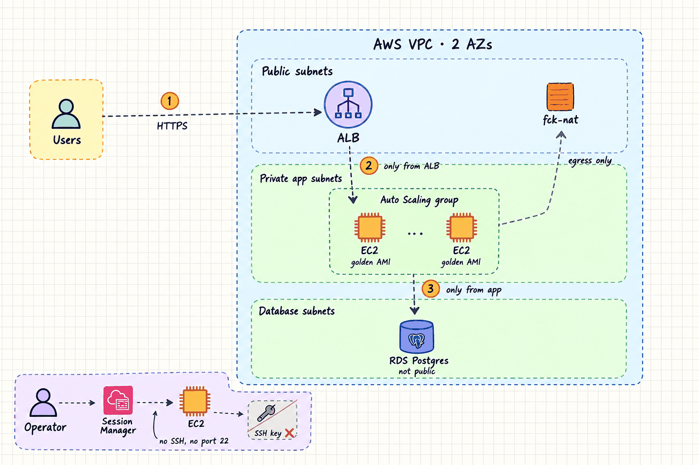
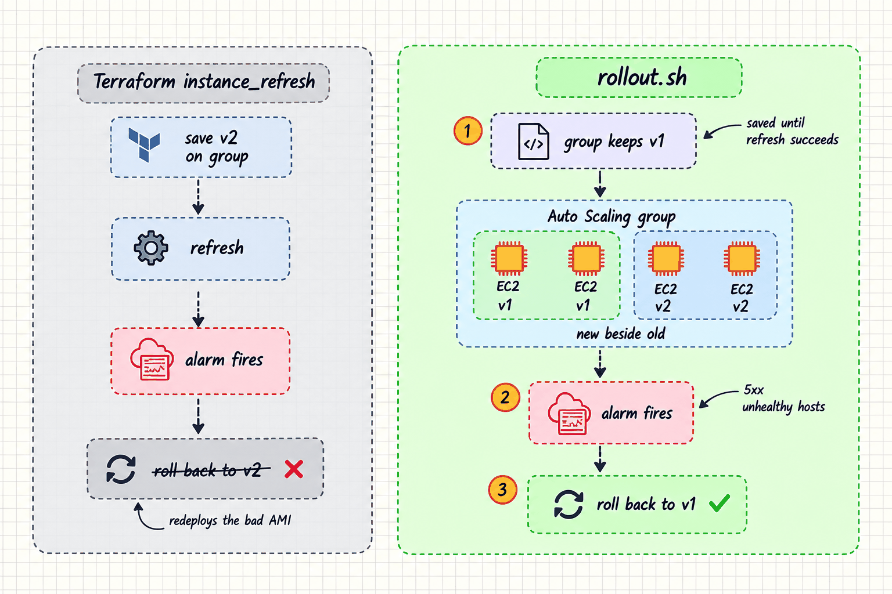

# Immutable EC2 Web Tier

A personal AWS lab: a small API on an EC2 fleet where servers are never patched
in place. Every change becomes a new golden AMI, the Auto Scaling group replaces
the fleet behind an ALB, and a CloudWatch alarm rolls a bad release back on its
own. Everything is Terraform, applied from CI over GitHub OIDC with no static
AWS credentials, no SSH and no bastion.

**Project page:** https://talhaimtiaz09.github.io/immutable-ec2-web-tier/



## Status

| Part | State |
|---|---|
| Terraform: `bootstrap`, `vpc`, `alb-asg`, `rds`, `envs/lab` | Written; passes fmt, validate, tflint and trivy |
| CI: plan on PR, approved apply, rollout | Written; passes actionlint |
| `scripts/rollout.sh`: instance refresh with alarm-gated auto rollback | Written; passes shellcheck |
| App, Packer + Ansible golden AMI, k6 load test | Not started |
| Verification drills and runbooks | Not run. Results are published as measured |

## Layout

```
terraform/
  bootstrap/      state bucket, GitHub OIDC provider, plan / apply / ami-builder roles, budget
  modules/vpc     3 subnet tiers x 2 AZs, fck-nat, S3 gateway endpoint
  modules/alb-asg ALB, launch template, ASG, target tracking, rollback alarms, dashboard
  modules/rds     private Postgres, customer-managed KMS key, RDS-managed secret
  envs/lab        wires the modules; ami_id lives in lab.tfvars
scripts/rollout.sh
.github/workflows/terraform.yml
docs/index.html   the project page (GitHub Pages); diagrams in docs/images/
prompts/          ChatGPT prompts for those diagrams
```

## Release flow

A release is a pull request that changes one line, `ami_id` in
`envs/lab/lab.tfvars`. CI plans it with a read-only role; after review, the
apply role (gated by the `lab` GitHub Environment) creates a new launch template
version and `scripts/rollout.sh` refreshes the fleet. Both roles are assumed over
GitHub OIDC. The image build step is not built yet.


## Why the rollout runs outside Terraform

AWS rolls a failed instance refresh back to the configuration saved on the group
*before* the refresh started. Terraform's `instance_refresh` block saves the new
launch template version first, so its rollback would redeploy the bad AMI. Here
the ASG ignores launch template changes, Terraform only creates the new version,
and `scripts/rollout.sh` starts the refresh with that version as
`DesiredConfiguration`. The group keeps the old version saved until the refresh
succeeds.



Setup and CI details: [`terraform/README.md`](terraform/README.md).

## Cost

About $2/day while running (ALB, two t4g.small, db.t4g.micro, fck-nat on a
t4g.nano). `envs/lab` is destroyed between sessions.
